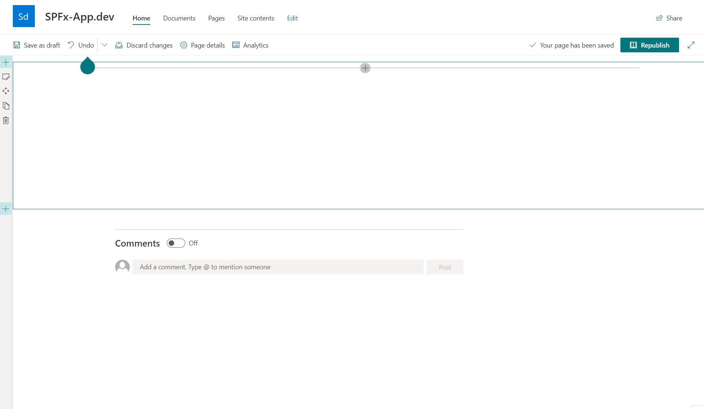

# SPFx Richtext Editor with Placeholdern and Reusable Content

## Summary

This WebPart allows you to write rich text and use placeholders that are automatically replaced in display mode. For example, the web url or the web title can be displayed or even the properties from the user profile field of the currently logged in user. There is also the possibility to use a known feature from SharePoint Classic again ==> Reuasble Content

## Download

You can download the solution from here: https://github.com/SPFxAppDev/sp-rte-webpart/releases

## Used SharePoint Framework Version & PnP Richtext Control

SPFx: 1.12.1 

PnP Richtext control: 3.4.1 (I copied the code from the repository and customized it a bit)

## 

## Solution

Solution|Author(s)
--------|---------
spfxappdev-texteditor.sppkg | Seryoga https://spfx-app.dev/ 

## Version history

Version|Date|Comments
-------|----|--------
1.0.0| November 22, 2021| Initial release
1.1.0| March 11, 2022| Added "Greeting" Text Feature and allows theme support and full width section

---
